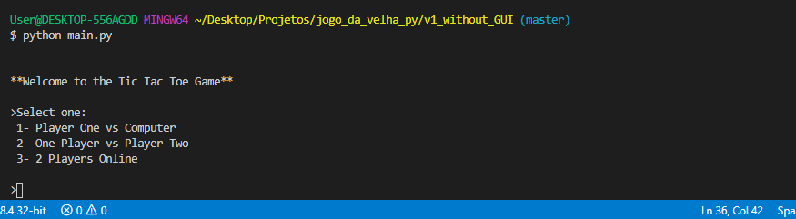

# :last_quarter_moon: Tic Tac Toe V1 Without GUI
This is the version without GUI.

A gif to see how it works:

## :floppy_disk: Tic Tac Toe Game

There are a matrix that have coordinates **(x,y)**

You have to choose one by one to get the acceptable outputs and win the game

When you run the program you will have to choose if you will play alone or with a friend

After that you will choose if you will be the first, so if you will select the first coordinate at the game

And the game starts

#### :books: Rules
The players can't select the same coordinate, only coordinates that have '0'

## :raising_hand: Acceptable Inputs
The row x can be only values: **0,1,2**

The column y can be only values: **0,1,2**

## :trophy: Acceptable Outputs (to Win)

The **entire row** have to be the number of the player 

OR the **entire column** have to be the number of the player

OR the **entire primary diagonal** have to be the number of the player

OR the **entire secondary diagonal** have to be the number of the player

## :bike: To run the game
> 1. You have to install Python
>
> 2. Open a terminal window or CMD and put: _"python main.py"_

## :family: 2 Player Online
This option is to play online with a friend.

The first player have to create a game to the other connect to that game.

The person who will connect to the game have to put the host ip.

**:v: Good game for you ;)**

